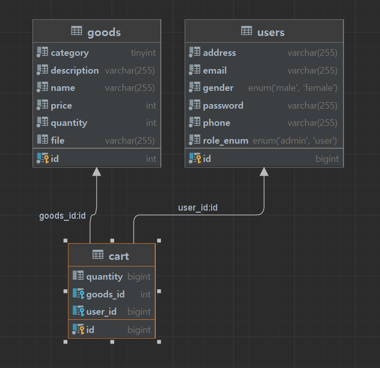
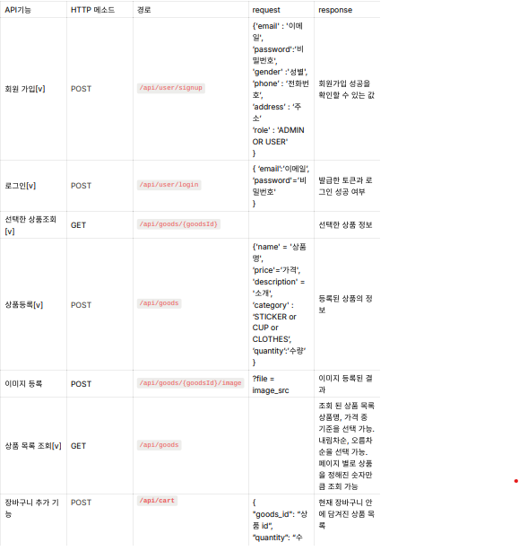
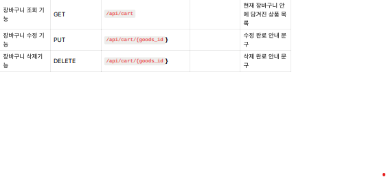

# 📋 스파르타 굿즈 샵 서버

-------------------------------------------------------------------------
## 💻 프로젝트 개요
- CRUD
- Spring Security와 JWT를 이용한 인증과 인가
- 권한 별 접근 제어
- JPA를 이용한 연관관계 매핑
- AWS S3를 이용한 이미지 업로드 

## 🎯 구현 목록
- [ ]  회원 가입 기능
    - `이메일`, `비밀번호`, `성별`, `전화번호`, `주소`, `권한`을 저장할 수 있습니다.
        - ADMIN, USER `권한`이 있습니다.
        - `이메일`은  `올바른 이메일 형식`을 지켜야 합니다.
        - `비밀번호`는  `최소 8자 이상, 15자 이하이며 알파벳 대소문자(a~z, A~Z), 숫자(0~9), 특수문자`로 구성되어야 합니다.
    - 회원가입 성공을 확인할 수 있는 값을 반환합니다.
        - ex) HTTP Status Code, Error Message …
- [ ]  로그인 기능
    - 회원은 `이메일`, `비밀번호`를 입력하여 서버에 로그인을 요청할 수 있습니다.
    - 로그인 성공 시, `회원의 정보`와 `JWT`를 활용하여 토큰을 발급하고,
      발급한 토큰을 Header에 추가한 후 로그인 성공을 확인할 수 있는 값과 함께 반환합니다.
        - ex) HTTP Status Code, Error Message …
- [ ]  상품 등록 기능
    - `상품명`, `가격`, `수량`, `소개`, `카테고리`를 저장할 수 있습니다.
        - 로그인을 통해 발급받은 JWT가 함께 요청됩니다.
        - ADMIN 권한을 가진 회원만 상품 등록이 가능합니다.
        - `카테고리` 종류는 자율입니다.
    - 등록된 상품의 정보를 반환 받아 확인할 수 있습니다.
- [ ]  선택한 상품 조회 기능
    - 선택한 상품의 정보를 조회할 수 있습니다.
        - 모든 사용자가 상품을 조회할 수 있습니다.
- [ ]  상품 목록 조회 기능
    - 등록된 상품들을 조회할 수 있습니다.
        - 모든 사용자가 상품을 조회할 수 있습니다.
        - 페이지 별로 상품을 정해진 숫자만큼 순서대로 조회할 수 있습니다. (Paging)
    - 조회된 상품 목록은 선택한 기준에 의해 정렬됩니다.
        - `상품명`, `가격` 중 기준을 선택할 수 있습니다.
        - 내림차순, 오름차순을 선택할 수 있습니다.
- [ ]  장바구니 추가 기능
    - 선택한 상품을 장바구니에 추가할 수 있습니다.
        - 로그인을 통해 발급받은 JWT가 함께 요청됩니다.
        - 회원만 장바구니에 상품을 추가하는 것이 가능합니다.
        - 장바구니에 추가된 상품은 구매할 만큼의 수량으로 선택될 수 있습니다.
        - 장바구니에는 여러 개의 상품이 추가될 수 있습니다.
    - 장바구니 추가 성공을 확인할 수 있는 값을 반환합니다.
        - ex) HTTP Status Code, Error Message …
- [ ]  장바구니 조회 기능
    - 장바구니에 추가된 상품들의 정보와 수량을 조회할 수 있습니다.
        - 로그인을 통해 발급받은 JWT가 함께 요청됩니다.
        - 회원만 장바구니 조회가 가능합니다.
    - 장바구니에 담긴 상품들의 총 결제 금액을 확인할 수 있습니다.
- [ ]  장바구니 수정 기능
    - 장바구니에서 선택한 상품의 수량을 수정할 수 있습니다.
        - 로그인을 통해 발급받은 JWT가 함께 요청됩니다.
        - 회원만 장바구니 수정이 가능합니다.
    - 장바구니 수정 성공을 확인할 수 있는 값을 반환합니다.
        - ex) HTTP Status Code, Error Message …
- [ ]  장바구니 삭제 기능
    - 장바구니에서 선택한 상품을 삭제할 수 있습니다.
        - 로그인을 통해 발급받은 JWT가 함께 요청됩니다.
        - 회원만 장바구니 삭제가 가능합니다.
    - 장바구니 삭제 성공을 확인할 수 있는 값을 반환합니다.
        - ex) HTTP Status Code, Error Message …
----------------------------------------------------------------------------------------------

## 🔥 **추가 구현 기능**
- [ ]  상품 이미지 기능
   - 상품의 이미지를 업로드할 수 있습니다.
      - AWS의 S3를 사용하여 저장합니다.
- [ ]  Spring Security를 적용하여 인증/인가를 구현합니다.
   - Security의 Secured 기능을 사용하여 권한별로 API를 제어할 수 있습니다.
----------------------------------------------------------------------------------------------

## 📁 ERD

----------------------------------------------------------------------------------------------

## 📃 API 명세서

https://documenter.getpostman.com/view/28626611/2sA2xmTA5N
## 개발자

- 신수현 a01065849764@gmail.com